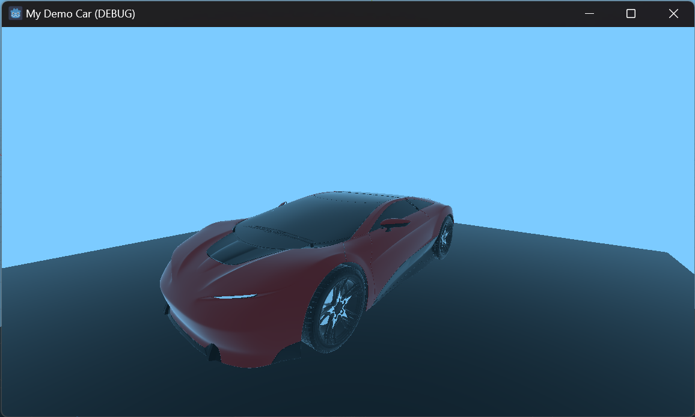

# Godot v4.2 Demo FBX 3D Model Car

Prerequisites:

- **Godot v4.2** : using 3rd party downloader [GodotEnv](https://github.com/chickensoft-games/GodotEnv) to download & install Godot v4.2 and restore the addon [Orbit Camera 1.1.0](https://godotengine.org/asset-library/asset/421)
- **FBX Demo 3D Model** : the model is from [Sketchfab - FREE Concept Car 004 - public domain (CC0)](https://sketchfab.com/3d-models/free-concept-car-004-public-domain-cc0-4cba124633eb494eadc3bb0c4660ad7e)

## Screenshots

